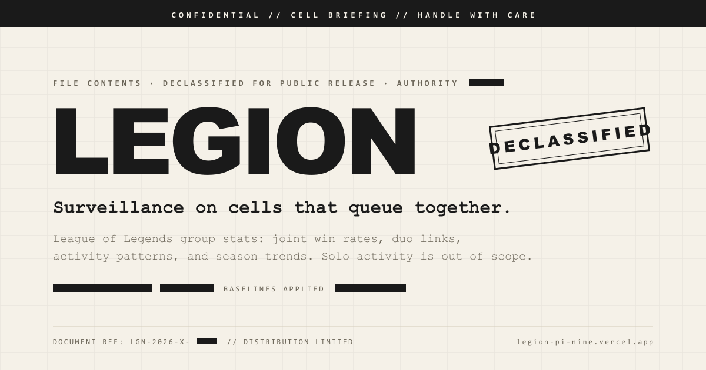

# LEGION



[](https://github.com/Lee-John-J/LEGION/actions/workflows/ci.yml)

Group stats for League of Legends. LEGION tracks how a **group of friends performs when they play together** — not individual stats (op.gg and Porofessor already do that), but the win rates, duo links, and behavioral patterns that only show up when 2+ of you are in the same game.

**→ Live: [legion-pi-nine.vercel.app](https://legion-pi-nine.vercel.app)**

The entire app is themed as a Cold War classified intelligence dossier — aged paper, typewriter fonts, classification stamps, redacted text blocks. Friend groups are **cells**, players are **operators**, the dashboard is a **briefing**.

## What you get

- **Joint win rate** across the games your group played together, with "WR without you" so each operator can see what they add
- **Link Analysis** — a pair-by-pair network graph of which duos actually win (win rate, shared games, and a bond class per pair)
- **Campaign Record** — a season trend of your rolling 20-game win rate, with idle "dark periods", a win/loss barcode, and streak records
- **Champion pools** per operator, split by map (Summoner's Rift / ARAM / Arena), with playstyle classifications (ONE-TRICK, SPECIALIST, CHAOTIC, …) and profile tags
- **Game mode breakdown** — win rate and volume per queue
- **Activity heatmap** — when your group is most active (7-day × 24-hour grid, in your timezone)
- **Analyst Observations** — six intelligence-style findings generated from your data (best duo, weakest map, one-trick exposure, late-night performance, and more)
- **Operation Log** — filterable joint match history grouped by day, with Arena placements
- Match data pulled from the **official Riot Games API**

Solo games are out of scope. LEGION only cares about the games you play together.

## Run it locally

Prerequisites: **Node 20+** (see `.nvmrc`), a [Supabase](https://supabase.com) project with `supabase_schema.sql` applied, and a [Riot Games API key](https://developer.riotgames.com) (development keys expire every 24 hours).

```bash
# Backend
cd server
npm install
cp .env.example .env        # fill in the variables below
npm run dev                 # http://localhost:3001 (nodemon; `npm start` for plain node)
```

```bash
# Frontend (separate terminal)
cd client
npm install
cp .env.example .env        # fill in VITE_SUPABASE_URL, VITE_SUPABASE_ANON_KEY
npm run dev                 # http://localhost:5173, proxies /api to :3001
```

In `npm run dev` with no session, the client signs you into a fake **NIGHT SHIFT** cell with mock data so every page can be previewed. Sign in to see real data. The mock module is excluded from production builds.

### Environment variables

| Where | Variable | Required | Purpose |
|---|---|---|---|
| `server/.env` | `SUPABASE_URL` | yes | Supabase project URL (the server refuses to start without it) |
| `server/.env` | `SUPABASE_SERVICE_ROLE_KEY` | yes | Service-role key — server only, never shipped to the browser |
| `server/.env` | `RIOT_API_KEY` | yes | Riot Games API key |
| `server/.env` | `RIOT_REGION` | no | Routing region for account/match lookups (default `americas`) |
| `server/.env` | `PORT` | no | API port (default `3001`) |
| `server/.env` | `CLIENT_ORIGIN` | no | CORS origin for local dev (default `http://localhost:5173`) |
| `client/.env` | `VITE_SUPABASE_URL` | yes | Supabase project URL (auth only) |
| `client/.env` | `VITE_SUPABASE_ANON_KEY` | yes | Supabase anon/publishable key |

### Checks

```bash
cd server && npm test        # stats engine + season boundary tests (node --test)
```

```bash
cd client && npm run lint    # ESLint (React hooks + refresh rules)
```

The same two checks run in GitHub Actions on every push and pull request (`.github/workflows/ci.yml`).

## Stack

| Layer | Technology |
|---|---|
| Frontend | React 19, Vite, Tailwind CSS 4, React Router 7 |
| Backend | Node.js 20+, Express 5 |
| Database | PostgreSQL via Supabase |
| Auth | Supabase Auth (email + password) |
| External API | Riot Games API (account-v1, match-v5) |
| Deployment | Vercel (static frontend + the Express app as one serverless function via `api/[...path].js`) |

## How it works

1. **Enlist** with an email, a passcode, and your Riot ID. The Riot ID is verified against Riot before the account is created.
2. **Open a new file** (create a cell) or **join one** with its `LGN-XXXX-XXXX` invite code. Cells hold up to 10 operators; the creator is the cell's handler.
3. **Sync Intel** pulls the current season's match IDs for every operator, stores the raw match payloads in Supabase (each match is fetched from Riot exactly once), and files up to 40 new matches per click — repeat until the log reports `INGEST COMPLETE`.
4. The **Briefing** computes everything from the stored matches. Only games with 2+ cell members on the same team (or the same Arena subteam) count; remakes are discarded.

## Deployment notes

- Vercel builds `client/` (`cd client && npm run build`) and routes `/api/*` to `api/[...path].js`, which wraps `server/index.js` as a single function (60 s max duration). Everything else falls back to the SPA.
- Set the server variables above in the Vercel project. The client variables are baked in at build time.
- Add `https://<your-domain>/authenticate` to Supabase's Auth redirect URLs so passcode-reset emails land on the reset form.
- `vercel.json` also sets long-lived caching for hashed assets and the standard security headers.

## Project structure

```
LEGION/
├── client/                 React frontend (Vite)
│   ├── public/             favicon, OG image, robots.txt, sitemap.xml
│   └── src/
│       ├── pages/          Landing, About, Authenticate, Intake, Briefing, OperationLog
│       ├── components/     Header, PageHeader, CampaignRecord, CellOverlay, ConfirmModal, …
│       ├── hooks/          Auth context + session management, clipboard helper
│       └── lib/            Supabase client, API wrapper, mode names, dev-only mock data
│
├── server/                 Express backend
│   ├── middleware/         JWT auth gate
│   ├── routes/             REST endpoints (cells, operators)
│   ├── services/           Riot API client (rate limiter + cache), stats engine, season window, tests
│   └── data/               Champion metadata (roles, classes, traits)
│
├── api/                    Vercel serverless entry point (wraps server/)
├── mockups/                Static HTML/CSS reference designs
├── .github/workflows/      CI (client lint + build, server tests)
├── supabase_schema.sql     Database schema (4 tables, 6 read/delete RLS policies, GIN index)
├── CLAUDE.md               Project spec and development guide
└── vercel.json             Build, rewrites, headers
```

## Design system

The visual language is defined in `mockups/dossier.css` and implemented in `client/src/index.css`:

- **Palette:** aged-paper backgrounds, near-black ink, semantic data colors (green/red/amber/blue for stats only)
- **Typography:** Space Grotesk (headers), Courier Prime (stats — typewriter feel), IBM Plex Mono (data tables)
- **Redactions:** black bars for empty states and classified flavor, announced as "[redacted]" to screen readers
- **Animations:** declassification reveal on page load, scanner sweep while loading — all honoring `prefers-reduced-motion`

## Key terminology

| Normal | LEGION |
|---|---|
| Friend group | Cell |
| Player | Operator |
| Group admin | Handler |
| Dashboard | Briefing |
| Match history | Operation Log |
| Register | Enlist |
| Login | Authenticate |
| Match with 2+ members on the same team | Joint Deployment |

## Built with

This project was built collaboratively using [Claude Code](https://claude.ai/code) (Anthropic's AI development tool). The full project spec that guided development is in [`CLAUDE.md`](CLAUDE.md).
